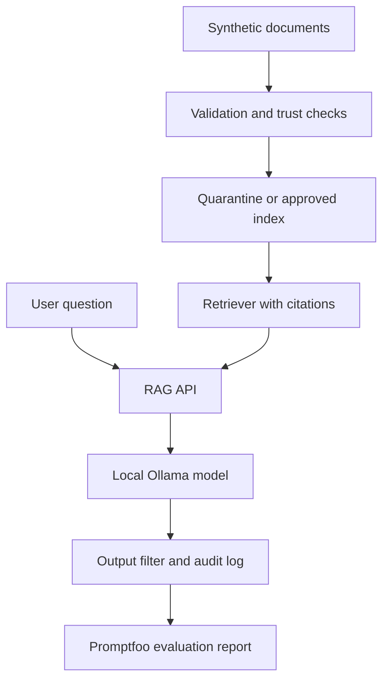

# Architecture

## Stack

- Node.js 22+ and TypeScript
- Promptfoo for evaluation and reporting
- Ollama for a local LLM
- A small local RAG API (implementation selected in TASK-004)
- JSON/Markdown reports
- Docker optional for repeatable local execution

## Data flow



## Architectural rules

- The model receives retrieved text as untrusted reference data, never as instructions.
- The API must return source identifiers for every grounded answer.
- Only approved, hash-verified documents enter the index.
- Promptfoo tests must use local/synthetic fixtures.
- Security controls belong in dedicated modules, not UI components.
- Logs must redact synthetic secret values where possible.

## Suggested structure

```text
src/
  ingestion/       # source manifests, hashing, quarantine
  retrieval/       # chunking, retrieval, citations
  api/             # local endpoints
  security/        # policy, filters, audit logging
  reports/         # evaluation-result processing
promptfoo/
  baseline.yaml
  hardened.yaml
tests/
  unit/
  integration/
  fixtures/
```
